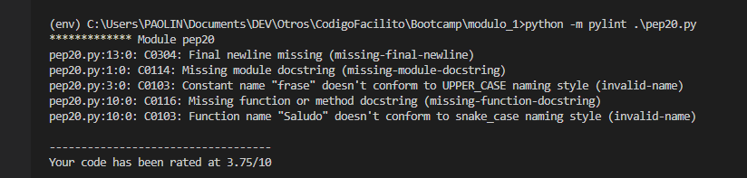

#  Qué es PEP
- Propuesta de Mejora de Python; documentoq que describe nuevas caracteristicas para python (diseño, estilo).

### PEP 0: 
- Contiene el índice de todas las propuestas de mejoras de Python.

### PEP 8: 
- Documento que proporciona pautas y mejoras prácticas sobre cómo escribir código Python. Escrito por Guido V.R.; el objetivo principal es __mejorar la legilibilidad y la consistencia__ de Python.

### PEP 20 (Zen de Python).
- Consta de 19 Reglas que de aplicarse correctamente en cualquier código lo  convierte en código pythónico.

        >>> import this

## PEP 8: Guía de Estilos de Python
- Naming Conventions

        TIPO ------- EJEMPLOS
        Function -> function. my_function
        Variable -> x, var, my_variable
        Class -> Model, MyClass
        Method -> class_method, method
        Constant -> CONSTANT, MY_CONSTANT
        Module -> module.py, my_module.py
        Package -> package, mypackage

Se recomienda nombrar sus objetos con __nombres descriptivos para dejar en claro lo qu se representa__.

- Code Layout: hermosos es mejor que feo

Maximum line length and line breaking: límites de caracteres a 79 en todas las líneas, salvo  las que contenga docstring o comnetarios, estas se limitan a 72.

- identation: "Debería haber una sola forma obvia de hacerlo"; Se prefiere el uso de 4 espacios consecutivos a espacios tabs, para indicar la sangría.

- Commemts: se usan para documentar una sección de código.
Documentacion Strings: se utiliza para funciones, clases y métodos públicos. (""" """) uso de las 3 comillas dobles.

- Whitescape in Expressions and Statements:
Rodee los los operadores binarios con un solo espacio a cada lado.

Recommendaciones adicionales:
- utilice __is not__ en lugar de __not .. is__ en declaraciones if.
- No utilice __if not__: cuando quiere decir __if x is not None__

## Linter
- programas que analizan el código y marcan los errores. Ejm: Pylint, Flake8.

### Pylint

instalar:

        pip install pylint

Evaluar el archivo

        python -m pylint.\pep20.py

Uso de linter pyint - Marca los errores

Levantando todos los errores 

### flake8
- mccabe: verifica que el código no sea demasiado complejo
- pyflakes: verifica los errores 
- pycodestyle: verifica que se siga la guía de estilo -> pep8

        pip install flake8

Uso de Flake8

        flake8 <name_file>

## Formatters
Herramienta que se utiliza para formatear automáticamente el código fuente.
Tenemos 2 herramientas entre las principales: black y pep8

### black
se instala como:

        pip install black

- Muestra los cambios en en caso que haya que formatear, muestra los cambios 

        black <name_file> --check --diff
        

- Muestra si hay cambios a formatear

        black <name_file> --check

- Ejecuta black

        black <name_file>

